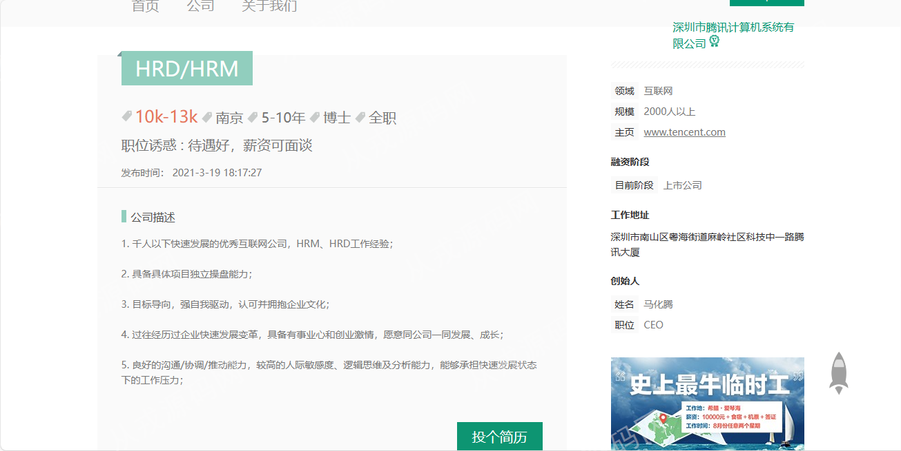
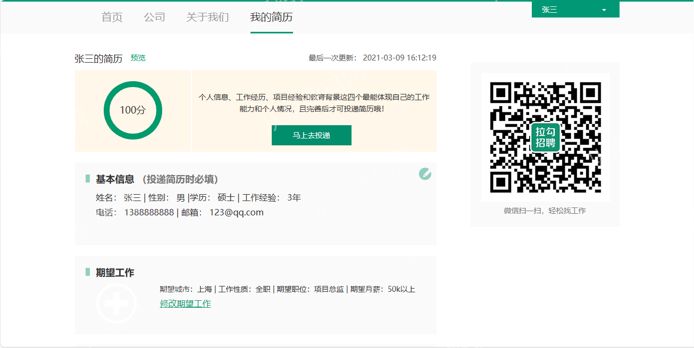
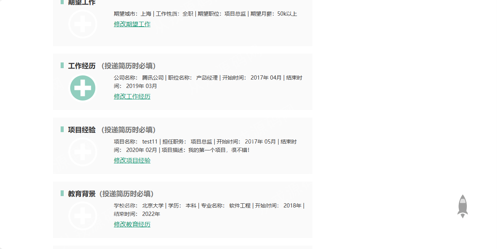
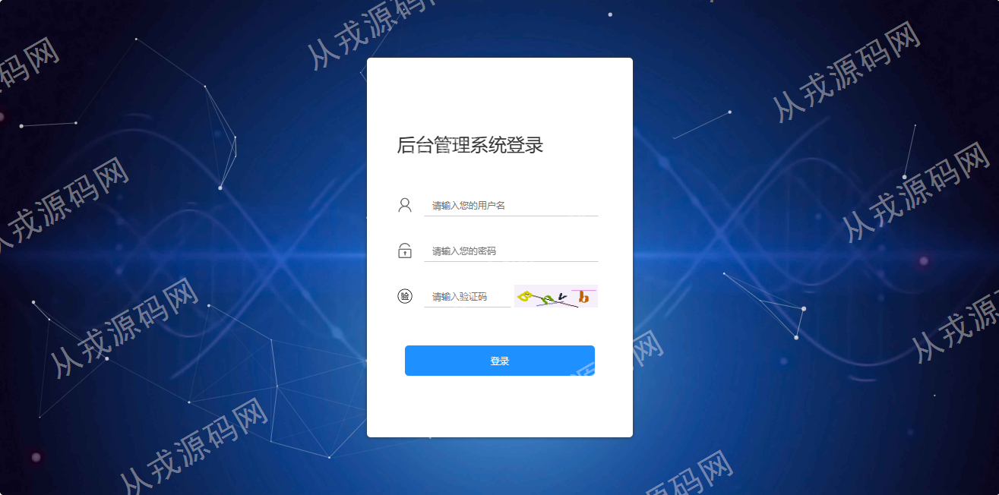
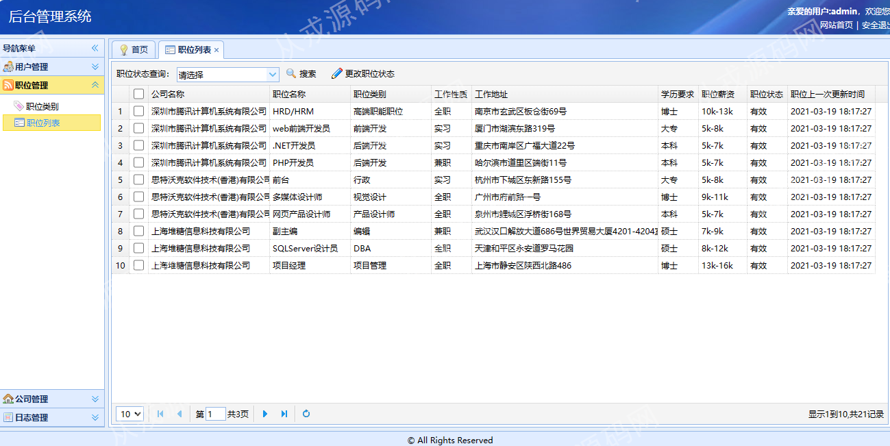
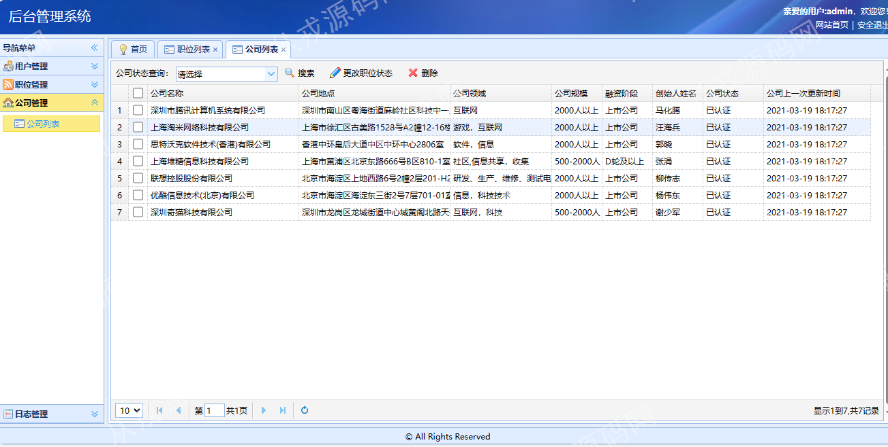

<h1 align="center">人才招聘管理系统</h1>

- <b>完整代码获取地址：从戎源码网 ([https://armycodes.com/](https://armycodes.com/))</b>
- <b>技术探讨、资料分享，请加QQ群：692619798</b> 
- <b>作者微信：19941326836  QQ：952045282</b> 
- <b>承接计算机毕业设计、Java毕业设计、Python毕业设计、深度学习、机器学习</b>
- <b>选题+开题报告+任务书+程序定制+安装调试+论文+答辩ppt 一条龙服务</b>
- <b>所有选题地址 ([https://github.com/YuLin-Coder/AllProjectCatalog](https://github.com/YuLin-Coder/AllProjectCatalog)) </b>

## 项目介绍
基于springboot的人才招聘管理系统：前端jquery、easyui，后端 maven、springmvc、spring、jpa、hibernate，集成职位浏览、我的简历、投递简历、职位管理、公司管理等功能于一体的系统。

## 功能介绍

### 管理员

- 用户管理：我的信息-针对自己个人信息的查看与修改，用户信息的查看和删除
- 职位类别管理：职位类别的树形列表，职位信息的增删改查
- 职位管理：职位列表，关键词搜索，更改职位状态
- 公司管理：公司列表，关键词搜索，职位删除，更改职位状态
- 日志管理：日志列表查询，日志删除

### 招聘者

- 基本功能：登录、注册、退出、更改密码
- 职位公司信息：职位列表查看、职位详情、公司列表查看、公司详情
- 我发布的职位：发布新职位，职位信息修改，职位信息删除，有效职位，待审核职位，已下线职位
- 我收到的简历：我收到的简历，待处理简历，已通知面试简历，不合适简历
- 我的公司主页：公司产品，公司介绍，招聘职位列表

### 求职者

- 基本功能：登录、注册、退出、更改密码
- 职位公司信息：职位列表查看、职位详情、公司列表查看、公司详情
- 我的简历：简历编辑，预览，简历投递，我投递简历历史列表，成功投递简历，通知面试，不合适的投递

## 环境

- <b>IntelliJ IDEA 2009.3</b>

- <b>Mysql 5.7.26</b>

- <b>Tomcat 7.0.73</b>

- <b>JDK 1.8</b>

## 运行截图

